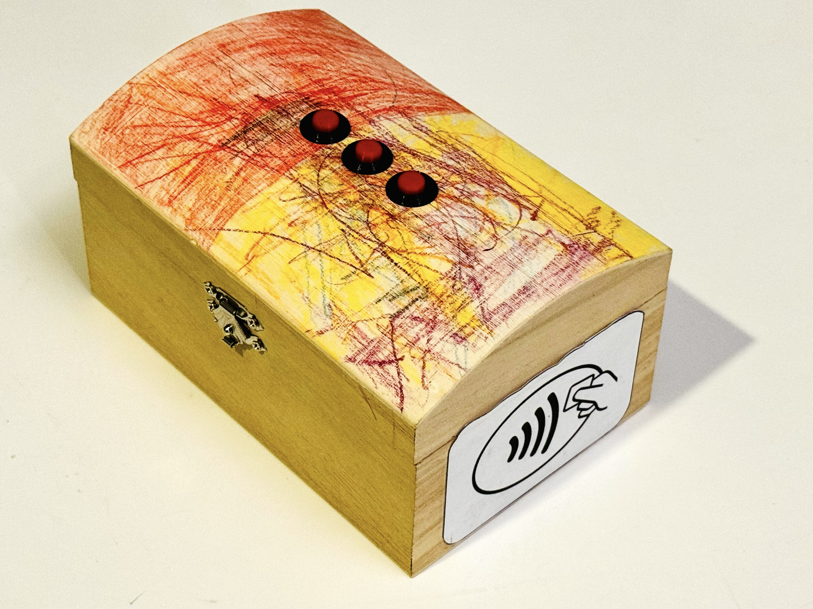
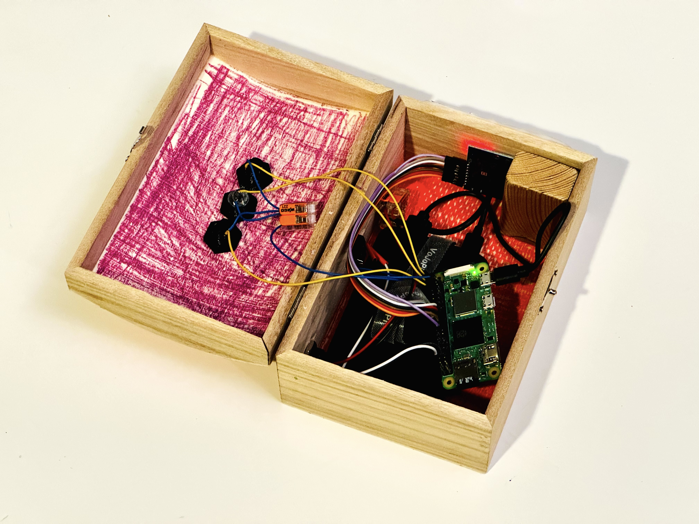
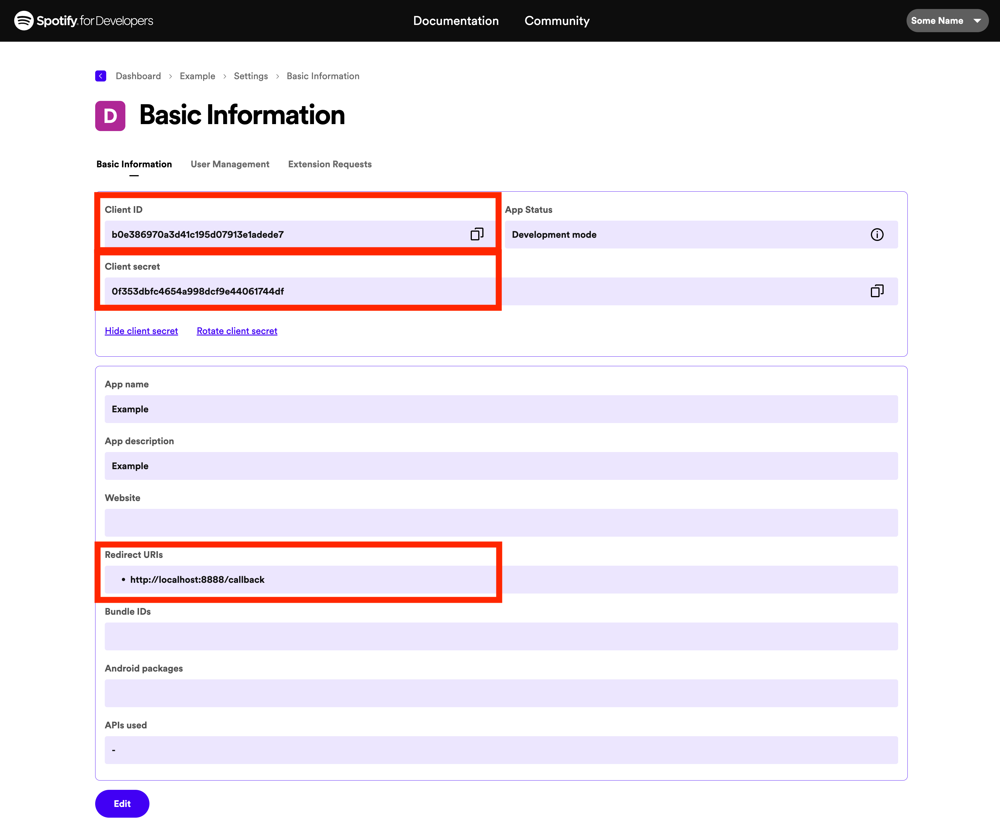

<p align="center">
  
</p>


<!-- TOC -->
* [What is spotbox?](#what-is-spotbox)
* [Hardware](#hardware)
  * [Buttons](#buttons)
  * [RFID](#rfid)
* [Installation](#installation)
  * [General dependencies](#general-dependencies)
  * [Spotbox Dependencies](#spotbox-dependencies)
  * [Install Spotbox](#install-spotbox)
  * [Setup bluetooth](#setup-bluetooth)
  * [Install Spotifyd](#install-spotifyd)
* [Spotify App](#spotify-app)
* [Configure Spotbox](#configure-spotbox)
* [Power saving](#power-saving)
  * [Disable HDMI port](#disable-hdmi-port)
  * [Reduce cores](#reduce-cores)
  * [Shutdown when not used](#shutdown-when-not-used)
  * [Power consumption values](#power-consumption-values)
* [Troubleshooting](#troubleshooting)
  * [Device not found](#device-not-found)
  * [Underruns](#underruns)
  * [Couldn't parse packet](#couldnt-parse-packet)
  * [Unknown](#unknown)
  * [Logs](#logs)
<!-- TOC -->

# What is spotbox?
<p align="center">
  
</p>

Spotbox is an open-source, battery-powered music player designed for family-friendly use.
At its heart is a Raspberry Pi, seamlessly integrating with Spotify for endless music streaming.
Instead of traditional mini figures, spotbox utilizes customizable RFID cards.
These cards can be effortlessly linked with your or your children's favorite albums or playlists,
offering a tangible and interactive music experience.
The device is energy-efficient and supports Bluetooth connectivity, allowing for wireless audio playback
on compatible devices.

If RFID cards should not be used, spotbox can also just be a slim way to connect your Bluetooth box to Spotify
using Spotify Connect.

# Hardware
Spotbox is build with a Raspberry Zero 2 W, an RC522 RFID scanner, some push bottons, a 10mAh power bank and an USB-C socket.
## Buttons
Currently four buttons are supported for Boot/Shutdown, Next, Previous and Play/Pause. They are wired as follows:

| Button         | Pin 1  |    Pin 2 |
|:---------------|:-------|---------:|
| Start/Shutdown | Pin 3  |     3.3V |
| Previous Song  | Pin 16 |   Ground |
| Play/Pause     | Pin 20 |   Ground |
| Next Song      | Pin 21 |   Ground |


## RFID
| Pi Zero         | RC522  |                    Description |
|:----------------|:-------|-------------------------------:|
| Pin 24 / GPIO08 | SDA    |                          ESP32 |
| Pin 23 / GPIO11 | SCK    |                          ESP32 |
| Pin 19 / GPIO10 | MOSI   |                          ESP32 |
| Pin 21 / GPIO09 | MISO   |                          ESP32 |
| -               | IRQ    |                     Not needed |
| Pin 25 / GND    | GND    |                          ESP32 |
| Pin 22 / GPIO25 | RST    |                          ESP32 |
| Pin 17 / 3V3    | 3.3V   |         ESP32 - Constant Power |
| Pin 15 / GPIO22 | 3.3V   | ESP32 - Smart Power (optional) |

Source: https://devdrik.de/pi-mit-rfid-rc522/

You can decide if you want to run the voltage of the RFID scanner permanently through a 3.3V Pin OR if you want spotbox
to enable and disable the RFID programatically. This will help to safe some Millamps when powered off

Do not forget to activate SPI in `raspi-config`!

# Installation
## General dependencies
`sudo apt-get install git vim checkinstall curl evtest`

## Spotbox Dependencies
```
pip3 install spotipy        # API for Spotify
pip3 install evdev          # Subscribe to BT button events (e.g. play/pause)
pip3 install xdg-base-dirs  # Find default directories
pip3 install pygobject      # Main loop for e.g. DBUS events
pip3 install pyudev         # Register to device events

pip3 install spidev
pip3 install mfrc522
```

## Install Spotbox
Install spotbox by cloning this repository:

```
cd ~
git clone REPO
```

This will clone spotbox to `~/spotbox` in your home directory. This path is also used in the below examples. 

Next we want to ensure that spotbox runs automatically in the background. For this we can create a user daemon as follows. 
Please replace `USER` with your username.


```
mkdir -p ~/.config/systemd/user/
cat >~/.config/systemd/user/spotbox.service << EOL
[Unit]
Description=Spotbox Daemon
Documentation=
Wants=sound.target
After=sound.target
Wants=network-online.target
After=network-online.target

[Service]
ExecStart=/usr/bin/python3 /home/USER/spotbox/spotbox.py
Restart=always
RestartSec=12

[Install]
WantedBy=default.target
EOL

systemctl --user daemon-reload
systemctl --user start spotbox.service
systemctl --user enable spotbox.service

```

## Setup bluetooth

First you should ensure that your user is in the `bluetooth` as well as the `audio`group:

    sudo usermod -a -G bluetooth `whoami`
    sudo usermod -a -G audio `whoami`

Now you can pair your device by running `bluetoothctl`. This opens an interactive session like the following.
Make sure that you find your device, trust and pair it:

	Agent registered
	[bluetooth]# power on
	Changing power on succeeded
	[bluetooth]# pairable on
	Changing pairable on succeeded
	[bluetooth]# agent on
	Agent is already registered
	[bluetooth]# scan on
	Discovery started
	[CHG] Controller B8:27:EB:10:5B:B6 Discovering: yes
	[...]
	[NEW] Device E8:07:BF:EF:F0:A8 Maginon BHF35
	[bluetooth]# trust E8:07:BF:EF:F0:A8
	[bluetooth]# pair E8:07:BF:EF:F0:A8
	Attempting to pair with E8:07:BF:EF:F0:A8
	[CHG] Device E8:07:BF:EF:F0:A8 ServicesResolved: yes
	[CHG] Device E8:07:BF:EF:F0:A8 Paired: yes
	Pairing successful

In this case the mac address of the bluetooth device is `E8:07:BF:EF:F0:A8`. Remember this mac address.
In my case I set up a simple helper script that establishes the connection for me if it should not work automatically in some cases:

Just execute this command, you will then be able to run it running `~/bin/bt_connect.sh`:

```
cat >~/bin/bt_connect.sh <<EOL
#!/bin/bash
# start pulseaudio
pulseaudio --start

# connect bluetooth speaker
bluetoothctl << EOF
connect E8:07:BF:EF:F0:A8 
quit
EOF
EOL
```

```
chmod +x ~/bin/bt_connect.sh
```


## Install Spotifyd
Spotifyd is a little daemon that runs in background of your device and makes it discoverable via Spotify Connect. 
This is mandatory, otherwise it is not possible to play music on the devices. 

For more details, follow these instructions: https://docs.spotifyd.rs/installation/Raspberry-Pi.html.
The following overview is just a brief summary and might be outdated soon:

This will download spotifyd, untar the archive and move the executable to the bin folder
```
wget https://github.com/Spotifyd/spotifyd/releases/download/v0.3.5/spotifyd-linux-default.tar.gz -O ~/Downloads/spotifyd.tar.gz
tar -xf spotifyd.tar.gz
mkdir -p ~/bin
mv spotifyd ~/bin/
```

Next we want to ensure that spotifyd runs automatically in the background. For this we can create a user daemon as follows:
The content of the daemon can be found here: https://github.com/Spotifyd/spotifyd/blob/master/contrib/spotifyd.service.
Please ensure that the `ExecStart` line points to the location of the spotifyd binary, in my case it is `/home/daniel/bin/spotifyd` .


```
mkdir -p ~/.config/systemd/user/
vim ~/.config/systemd/user/spotifyd.service 
systemctl --user daemon-reload
systemctl --user start spotifyd.service
systemctl --user enable spotifyd.service
```

# Spotify App 
In order to use spotbox, you need to create a Spotify developer account and create a development app.
Visit https://developer.spotify.com/dashboard in order to do so.


# Configure Spotbox
Spotbox is configured in the file `~/.config/spotbox/spotbox.conf`:

    [Bluetooth]
    macAddress = E8:07:BF:EF:F0:A8
    devicePath = /dev/input/event0
    
    [Spotify]
    deviceId = 545f4bc4825d1ec0b0fdf8f8f7ebffb1da6079ea
    clientId = b0e386970a3d41c195d07913e1adede7
    clientSecret = 0f353dbfc4654a998dcf9e44061744df
    redirectUri = http://localhost:8888/callback

    [Spotbox]
    readDelaySeconds = 1
    albumUrl = http://192.168.188.1/0_userdata.0.spotbox  
    shutdownAfterMinutes = 30

Overview of the configuration options

| Section   | Config               | Description                                                                                                 |
|:----------|:---------------------|:------------------------------------------------------------------------------------------------------------|
| Bluetooth | macAddress           | Mac address of the bluetooth speaker                                                                        |
|           | devicePath           | Device file to check for key presses. Run `evtest`to find the right device                                  |
| Spotify   | deviceId             | Device ID of your spotifyd client. When running spotbox for the first time it will output all known devices |
|           | clientId             | Client ID of your Spotify app                                                                               |
|           | clientSecret         | Client secret of your Spotify app                                                                           |
|           | redirectUri          | Redirect URI of your Spotify app                                                                            |
| Spotbox   | rfidReadDelaySecond  | RFID read interval. Lower number = faster, more CPU usage, Higher number = slower, less CPU usage           |
|           | albumUrl             | URL to read the album mapping from. Should return JSON of format {"RFID_ID": "SPOTIFY URL"}                 |
|           | shutdownAfterMinutes | Afer how many minutes should spotbox automatically shut down if nothing is being played. Default: 30        |

# Power saving
Generally spotbox has some complexity/dependencies to external libraries as I replaced all polling to e.g. bluetooth devices/input keys
with monitoring/signal receivers to reduce battery drain.
With that I could reduce the power consumption by half.  

## Disable HDMI port
Edit `/boot/config.txt` and change `dtoverlay=vc4-kms-v3d` to `#dtoverlay=vc4-kms-v3d`
Then run `sudo crontab -e` and add this line:

```
@reboot         /usr/bin/tvservice -o
```

## Reduce cores
The Raspberry PI Zero 2 W I use has 4 CPU cores. Deactivating some of the cores is said to help reducing the power consumption.

For that just edit `/boot/cmdline.txt` and add the parameter `maxcpus=N`- where `N` should be the number of CPUs, e.g. 1 or 2.
For details about possible savings check this blog post: https://www.cnx-software.com/2021/12/09/raspberry-pi-zero-2-w-power-consumption/#lowering-raspberry-pi-zero-2-w-power-consumption

At leas in my cease I could not find a significant reduction of power consumption. 

## Shutdown when not used
Spotbox supports shuttdown down the pi when not used. 

Run 

```
which shutdown
which reboot
```

to get the correct paths for both commands and allow them to be run without root privileges by adding them to the sudoers file: `sudo visudo`

Now add this line at the end and adjust the user name and the paths correspondingly to your case

```
daniel ALL=(ALL) NOPASSWD: /usr/sbin/reboot, /usr/sbin/shutdown
```

Spotbox will check every 5 Minutes if the Raspi is still playing - and shut down after half an hour of non-playing. Furthermore
you can manually shutdown the Raspi by long-pressing the start button for ~3 seconds.

Be aware that even when shut down, the Pi will still consume around 47mAh as it is never fully powered off when connected to power. 
When the RFID sensor is connected, it will draw another ~20mAh so that even when powered down the Pi might consume around 65mAh.


## Power consumption values
I measured this with a simple USB power meter - these are known to be less precise - so the values are an indication at best

**All these scenarios are with spotifyd and spotbox running,
no bluetooth, disabled HDMI port if not stated otherwise**

_RFID_
- With RFID without delay: 177mAh
- With RFID and 0.5 second delay: 120mAh
- With RFID and 1 second delay: 114mAh <-- **Reference**
- With RFID and 2 second delay: 104mAh
- With RFID and 99999 second delay: 97mAh
- Without RFID scanner: 82mAh

_Reducing the CPU cores_
- Reference with 1 CPU core: 107mAh
- Without RFID scanner with 1 CPU core: 87mAh

_Bluetooth_
- Reference with bluetooth connected and music playing: 135mAh

At this point it seems to me, that an RFID read interval of 1 second is a reasonable comporimise. 
I left the PI with 4 CPU cores, my impression was that with spotifyd and spotbox running, the reduced number of CPU cores
was more hurting than helping.

# Troubleshooting

## Device not found
If spotbox cannot find your device, try connecting to it with an official Spotify client, first. 
Usually after that spotbox can find it as well.

## Underruns
In some cases it seems that spotifyd crashes and restarts automatically (but playback naturally stops).

```
ALSA lib pcm.c:8545:(snd_pcm_recover) underrun occurred
```

I am not fully sure about that one, yet: It seems some folks recommend tweaking the options `default-fragments` and 
`default-fragment-size-msec` for pulseaudio in those cases. The back and forth of changing the parameters is explained here quite nicely: 
https://wiki.archlinux.org/title/PulseAudio/Troubleshooting#Disabling_timer-based_scheduling

## Couldn't parse packet
This one is probably more related to my setup: My spotifyd log was flooded with message like this:
```
couldn't parse packet from 192.168.188.54:5353: label in domain name has unknown label format
```
Even though this is not detrimental to the function of the setup, flooding the logs 24/7 on a system that is supposed to run on 
batter power is not ideal. 

I found out that those packets came from my FireTV stick. Restarting that fixed the problem temporarily - I also blocked 
the FireTV stick via Iptables:

```
sudo iptables -A INPUT -s 192.168.188.54 -j DROP
sudo iptables-save
```

## Unknown
This exception I could not yet figure out:
```
PANIC: Shutting down spotifyd. Error message: called `Result::unwrap()` on an `Err` value: Os { code: 19, kind: Uncategorized, message: "No such device" }
```

## Logs
Spotbox itself logs to `~/spotbox.log`. Additionally you can use `journalctl -n1 -fu spotbox.service` to watch the log of the daemon.
